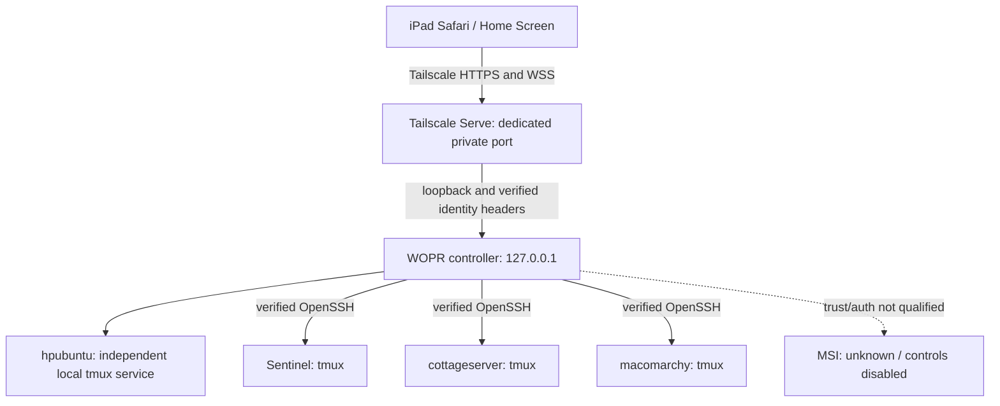

# WOPR Control v1

Private, touch-first rack console. The public WOPR display remains a separate,
unchanged showcase. No Agent Control dependency, browser SSH library or command
HTTP endpoint is used. Python/aiohttp owns OpenSSH PTYs; xterm renders genuine
I/O. Existing WOPR HTML/JavaScript are served unchanged inside the idle screen.



## Baseline and server regression

Baseline `e52575978e76c37feb2aaf8c44b7167e39524fb4`. The first server addition
defaulted to lights-only, stopped polling unless server mode was selected, and
hid the status element during WOPR frames. The previous fix restored polling,
all five identifiers and a five-second WOPR/H/S/WOPR/C loop. The subsequent
operator-requested hover change deliberately hid the text strip. That is the
current reason text is not always visible, rather than CORS or a missing API.
Live bytes matched source. Z-index, DOM generation, clipping and resize code
were inspected; paused resize was fixed in the prior work.

Private Control fixes discoverability with a touch-to-reveal machine screen.
It samples the hosts itself instead of depending on the public collector.
Public HTML/JavaScript remain byte-for-byte unchanged by this release. The
publication builder explicitly excludes this directory; privacy scanning
rejects accidental `wopr_control` files. Its allowance for the existing public
machine labels does not authorize publishing private control data.

## Installation on hpubuntu

Use a dedicated release directory outside Apache, for example
`/fast/wopr-control/releases/<commit>`. It must include this directory and the
repository's `wopr-light-display.html` and `assets/wopr-light-display.js`.

```sh
python3 -m venv /fast/wopr-control/venv
/fast/wopr-control/venv/bin/pip install -r wopr_control/requirements.lock
cd wopr_control
npm ci --ignore-scripts
npm run vendor
mkdir -p /fast/wopr-control/config /fast/wopr-control/state
chmod 700 /fast/wopr-control/config /fast/wopr-control/state
```

Copy the example inventory and configuration into the private config directory.
Set `allowed_users` to the explicit Tailscale owner login, `origin` to the exact
Serve HTTPS origin, and use absolute inventory/state paths. Keep configuration
mode 0600, outside Git and the web root. The controller refuses non-loopback
binding, non-Tailscale HTTPS origins and an empty user allow-list.

Set `/fast/wopr-control/current` to the qualified release. Install both supplied
user service files into `~/.config/systemd/user/`, then:

```sh
systemctl --user daemon-reload
systemctl --user enable --now wopr-tmux.service wopr-control.service
systemctl --user status wopr-control.service
journalctl --user -u wopr-control.service --no-pager
```

The tmux guardian is a separate service and socket. Restarting the controller
does not restart it. Do not stop `wopr-tmux` merely to restart the UI/controller:
its explicit stop operation ends the controller-host shells. Linux peers own
their remote tmux servers independently. Keep the user manager running at boot
using the host's existing user-manager/linger policy; inspect it first.

## SSH and inventory

Inventory version 1 has a `machines` array; add a unique lowercase id and the
metadata shown in `inventory.example.json`, then restart the controller.
Credentials/passwords are forbidden. `ssh_target` is a pre-existing trusted
SSH alias; port is explicit, not inferred as 22. Sentinel/cottageserver use
2222; macomarchy uses 22. Host-key checks, batch public-key authentication,
no agent forwarding and no arbitrary network target supplied by the browser
are enforced. Existing controller-host keys/config are reused; no new key was
distributed. A dedicated restricted account/key is a sensible future hardening
step, but v1 uses the established normal `loz` account and its existing rights.
Only the exact configured Tailscale owner may use it.

hpubuntu's loopback SSH authentication was not available. A direct local tmux
connection avoids adding/weakening SSH trust and still provides a real shell on
the actual controller machine. This connection method is explicit in inventory.
MSI OpenSSH is running on port 22, but controller trust/authentication is not
qualified. No Windows service, firewall, key or account was changed. MSI remains
unknown with no terminal until a separately verified adapter/SSH path is added.
The current sampler and tmux adapter support Linux; do not enable them for a
Windows target without implementing and qualifying the Windows adapter.

## Private Tailscale Serve

Inspect `tailscale serve status --json` before changing anything. This host's
443 is an unrelated public Funnel; never mount WOPR there. A separate private
Serve port is mandatory:

```sh
sudo tailscale serve --bg --https=8445 http://127.0.0.1:18892
tailscale serve status --json
```

If Tailscale requests administrative authorization, complete that step manually;
do not enable Funnel or change tailnet policy to bypass it. Confirm no
`AllowFunnel` entry exists for 8445 and that existing handlers are unchanged.
The browser must access the exact configured origin. Serve strips spoofed
identity headers and supplies the authenticated tailnet user's identity.
The controller accepts them only from loopback, checks Host and exact user,
then issues a Secure, HttpOnly, SameSite=Strict eight-hour cookie. Mutations
and WebSocket upgrades require exact Origin. WSS additionally uses a single-use
30-second ticket bound to user/session; tickets are sent as subprotocols rather
than URLs. Open sockets close when application authentication expires.
Local privileged processes remain in the trusted controller-host boundary.
No shared browser token, password or SSH private key is delivered.

Private origin pattern: `https://<controller>.<tailnet>.ts.net:8445`.
The actual origin is retained in the private host configuration and the local
qualification report, rather than publishing the tailnet identity in Git.
Never proxy it from `lozknowles.com`, enable Funnel for it, or forward 18892 on
the router. Tailnet membership and the configured owner identity are required
both in the rack and away from home. Tailscale Serve and identity checks were
verified from the MSI tailnet client; physical off-site iPad routing is separate
qualification.

## Sessions, touch and iPad

WOPR → touch to reveal Machines → select a large tile → Terminal.
Up to four panes can be active; choose any manageable inventory machine.
Touch a terminal or its expand control to enlarge it; **2 × 2 View** restores
the grid while the other connections remain alive. **Keyboard** focuses the
selected xterm textarea for Safari's software keyboard; hardware keyboards,
ANSI colour, scrolling and standard selection/copy/paste use xterm. Detach
removes a pane, preserving its shell. Resume selects an existing session.
Terminate requires a modal confirmation and an exact server-side session
confirmation. There are no reboot/shutdown/process-kill/service-stop buttons.

Shells use `wopr-<machine>-<16-hex-session>`; metadata is mode 0600. Remote tmux
uses its own `-L wopr` socket, preserving unrelated tmux sessions. The local
guardian uses `/fast/wopr-control/state/tmux.sock` and a keeper session. List:

```sh
tmux -S /fast/wopr-control/state/tmux.sock list-sessions
ssh sentinel 'tmux -L wopr list-sessions'
```

Metadata distinguishes active, disconnected, resumable and terminated. A lost
tmux session is reported terminated; it is not silently recreated. Page reload,
navigation and network loss do not destroy shells. Controller restart retains
metadata and reconnects to existing tmux sessions. Historical terminal replay
suppresses device-response input; this avoids corrupting shells on reconnect.

On the iPad install Tailscale and sign into the authorized tailnet. In Safari
open the private URL, use Share → Add to Home Screen, and use landscape.
Manifest/Apple metadata, safe-area padding and visual-viewport resizing are
included; no App Store app or offline service-worker cache is required. A
disconnected console must not serve stale state as online. Idle timeout defaults
to 120 seconds, configurable in private config; touching idle wakes immediately.
1366×1024 touch browser qualification is not physical iPad/Safari qualification.

## Telemetry, events and failures

Four Linux machines are independently sampled concurrently every 15 seconds
with a 0.25-second CPU sample and bounded SSH/GPU calls. CPU/RAM/storage,
uptime, network byte rate, temperature and NVIDIA GPU/VRAM are returned when
available. A missing GPU or tmux capability is degraded, stale/invalid samples
are unknown, refused endpoints are offline, and authentication errors are
degraded. Timeouts do not prove offline. One target cannot break another.
Processes/services/GPU/logs are fixed bounded read-only queries on demand,
not arbitrary HTTP commands. Log access remains limited by the SSH account.

`GET /api/activity` is an authenticated, provider-neutral event read model:
source, machine, type, state, timestamp, intensity, metadata. It currently derives
OS CPU and WOPR session events. Future controller-side adapters may contribute
activity without a public ingest API; Agent Control is entirely optional.

Audit logs contain session lifecycle and fixed-query metadata, not terminal
keystrokes/output, credentials or ticket/cookie values. Terminal content can
contain secrets; evidence and recordings remain private. There is an in-memory
bounded reconnect replay buffer, not a disk shell transcript.

Troubleshooting: first inspect the user service journal and private status screen.
Unknown MSI is expected; degraded macomarchy currently indicates absent NVIDIA
telemetry. Verify `ssh -o BatchMode=yes -o StrictHostKeyChecking=yes -p <port>
<alias> hostname` from hpubuntu. Do not use `StrictHostKeyChecking=no` to fix trust.
Check the separately named tmux socket, exact Serve origin, tailnet identity and
private port. A WSS loss should reconnect with backoff; an expired app cookie is
renewed only through a still-authorized Serve identity.

## Tests and rollback

```sh
python -m unittest discover -s tests -p 'test_*.py'
node --test tests/*.test.mjs tests/*.test.cjs
python scripts/build_publication.py
python -m unittest discover -s wopr_control/tests -v  # Linux, controller venv
npm test --prefix wopr_control
```

Use the private live-browser qualification evidence separately from fixtures.
Do not publish its terminal recordings through the public site.

To withdraw Control, stop/disable only `wopr-control.service` and remove only its
Serve route with `sudo tailscale serve --https=8445 off`. Leave `wopr-tmux` and
the remote WOPR tmux servers running if their sessions are needed. Archive state
and config privately. The existing 443/8444/19441 routes remain untouched. To
roll code back, stop the controller, atomically point `current` at the prior
release, and start it again. No public files need rollback because none changed.
Do not run `tailscale serve reset` or `tmux kill-server` on unrelated sockets.
